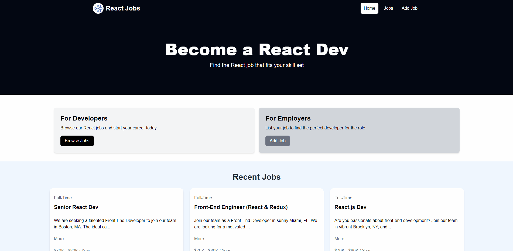

# React Job Search App

A job search application built with React and Vite, using a mock JSON server for data. This app provides a simple interface to search and manage job listings, leveraging React's component-based architecture for a responsive and interactive user experience.


## Features
- **CRUD Operations**: Create, Read, Update, and Delete job listings.
- **Responsive Design**: Works well on both desktop and mobile devices.
- **Mock Data**: Utilizes a mock JSON server to simulate backend functionality.

## Technologies

- **React**: A JavaScript library for building user interfaces.
- **Vite**: A modern build tool that provides fast development and optimized production builds.
- **JSON Server**: A simple tool to create a mock REST API with JSON data.

## Getting Started

Follow these instructions to set up the project on your local machine:

### Prerequisites

- [Node.js](https://nodejs.org/) (version 22.5.1)

### Installation

1. **Clone the repository:**

   ```bash
   git clone https://github.com/your-username/react-job-search-app.git
   ```

2. **Navigate to the project directory:**

   ```bash
   cd react-job-search-app
   ```

3. **Install dependencies:**

   ```bash
   npm install
   ```

4. **Start the JSON server:**

   In one terminal, navigate to the `mock-server` directory and run:

   ```bash
   npm run server
   ```

   This will start the mock JSON server, typically running on `http://localhost:5000`.

5. **Start the React development server:**

   In another terminal, run:

   ```bash
   npm run preview
   ```

   This will start the Vite development server, typically running on `http://localhost:3000`.

6. **Open your browser and go to:**

   ```plaintext
   http://localhost:3000
   ```

   You should see the React Job Search App running.
7. **Run both server and app using this:**
   ```bash
   npm run preview-with-server
   ```

## Project Structure

- `src/`: Contains the source code for the React application.
  - `components/`: React components used in the application.
  - `pages/`: Different pages/routes of the application.
  - `services/`: API calls and data fetching logic.
  - `App.jsx`: The root component of the application.
  - `index.jsx`: Entry point for the React application.
- `mock-server/`: Contains the JSON Server setup and mock data.
  - `db.json`: The mock database file for JSON Server.
  - `server.js`: JSON Server configuration file.
- `vite.config.js`: Configuration file for Vite.

## Configuration

- **Mock Server**: The mock server is configured to run on port 5000. You can change the port in `mock-server/server.js` if needed.
- **API Endpoints**: The app communicates with the mock server at `http://localhost:5000`.

## Running Tests

To run tests, use:

```bash
npm test
```

## Deployment

For production builds, run:

```bash
npm run build
```

This will create a production-ready build in the `dist/` directory. You can deploy this directory to any static file hosting service.

## Contributing

Feel free to fork the repository and submit pull requests. For major changes or feature requests, please open an issue first to discuss what you would like to change.

## License

This project is licensed under the MIT License - see the [LICENSE](LICENSE) file for details.

## Acknowledgements

- [React](https://reactjs.org/)
- [Vite](https://vitejs.dev/)
- [JSON Server](https://github.com/typicode/json-server)

---

Made with ❤️ by [Tushar Mahat](https://github.com/tusharmahat/)
```

Replace `your-username` and `Your Name` with your actual GitHub username and name. Adjust any specific details about the project structure or setup as needed.
